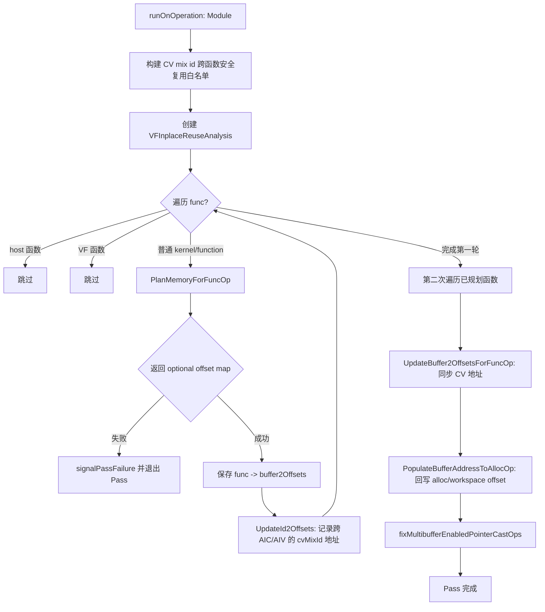
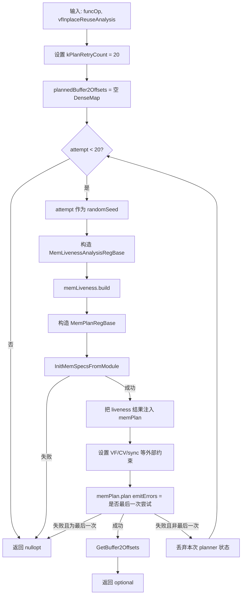
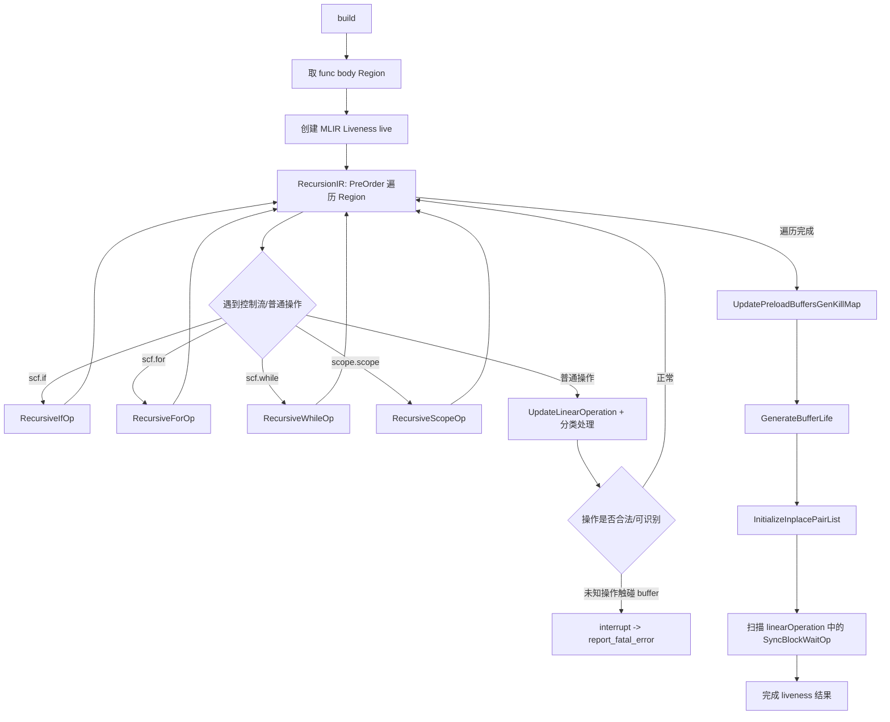
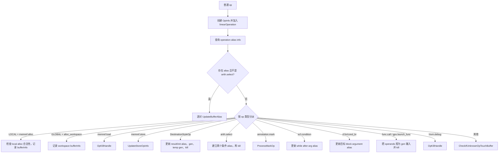
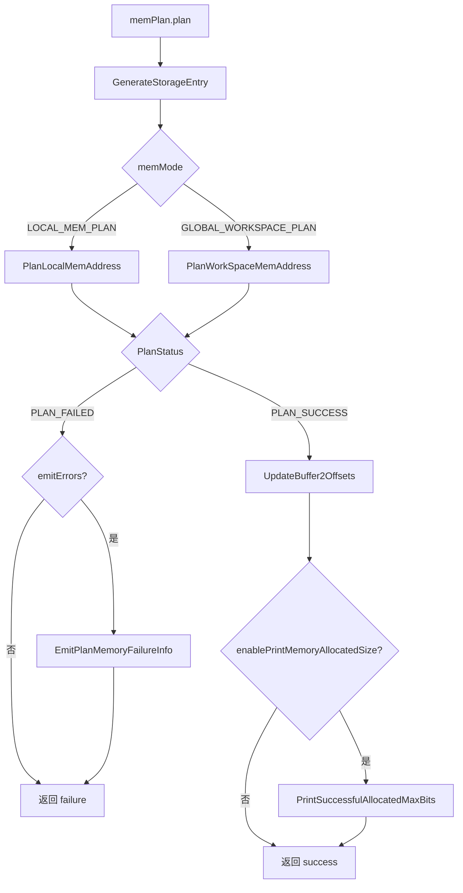
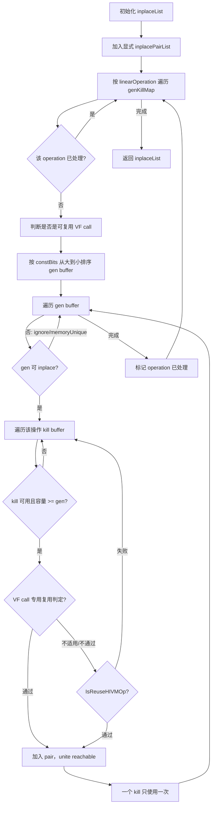
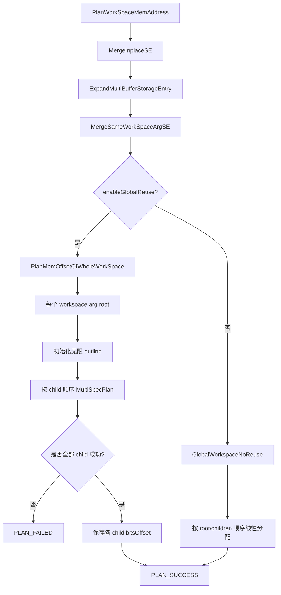
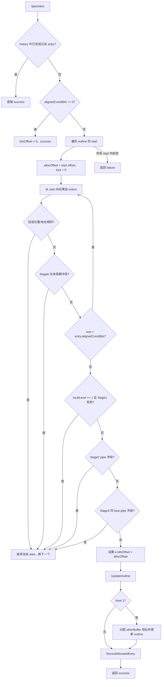
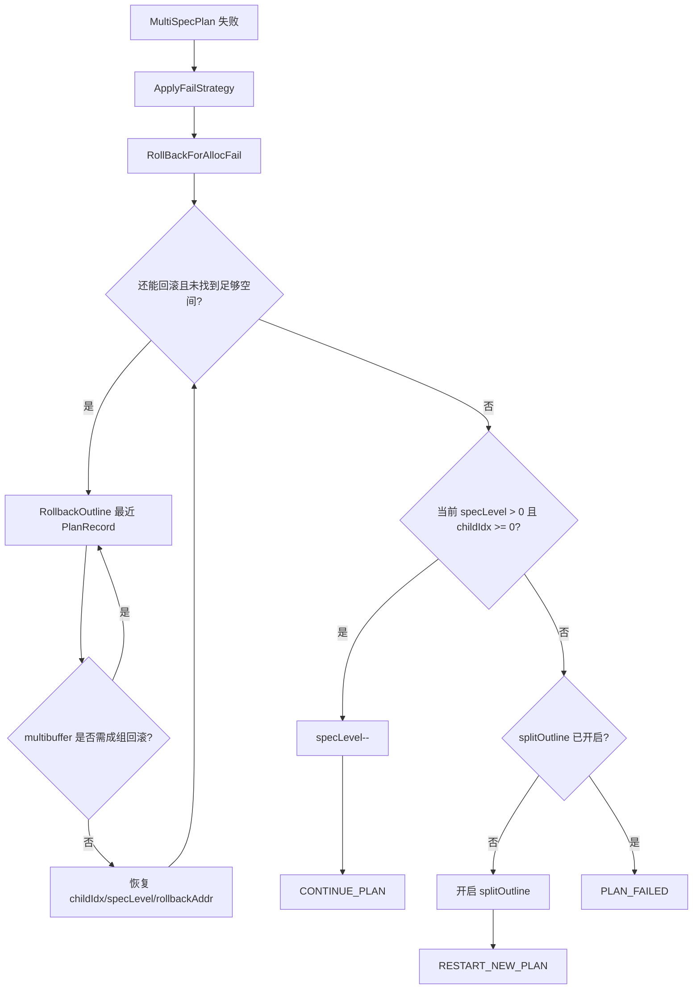

# `PlanMemoryForFuncOp` 详细行为流程图

本文以 `PlanMemoryPass::PlanMemoryForFuncOp` 为中心，描述一次函数级内存规划的完整行为。重点展开它直接调用的两个阶段：

1. `MemLivenessAnalysisRegBase::build()`：从函数 IR 收集 buffer、别名、gen/kill 和生命周期。
2. `MemPlanRegBase::plan()`：把生命周期信息转换成 `StorageEntry`，执行原地复用、区间复用和地址分配。

函数对应源码位置：

- `PlanMemoryForFuncOp`：`PlanMemory.cpp:3028`
- `MemLivenessAnalysisRegBase::build`：`PlanMemory.cpp:159`
- `MemPlanRegBase::plan`：`PlanMemory.cpp:1373`
- `PlanMemoryPass::runOnOperation`：`PlanMemory.cpp:3262`

## 1. 在整个 Pass 中的位置

`PlanMemoryForFuncOp` 不是独立执行的顶层入口，而是由 `runOnOperation` 对每个非 host、非 VF 函数调用。它只负责“分析并规划一个函数”，返回 `Value -> offset vector`；跨函数 CV buffer 地址同步和最终 IR 回写发生在后续第二次遍历。



## 2. `PlanMemoryForFuncOp` 主流程

源码当前固定最多尝试 20 次。每次尝试都会重新建立 liveness 分析对象和 memory planner，而不是复用上一次尝试产生的中间状态。`attempt` 同时作为 `MemLivenessAnalysisRegBase` 的随机种子，因此重试是确定性的：同一个输入、同一套配置下，每次运行得到的 20 个候选顺序相同。



### 2.1 每次尝试接收的输入

调用者提前创建的 `VFInplaceReuseAnalysis` 是模块级分析结果；本函数通过：

```cpp
vfInplaceReuseAnalysis.getVFCallInplaceReuseInfo(funcOp)
```

取得当前函数对应的 VF call 原地复用信息，传给 `MemPlanRegBase`。此外，Pass 级别预先计算的 `cvMixIdReuseAllowedPairs_` 也会被传入当前 planner。

本次函数级规划使用的输入可以分成三类：

| 输入 | 来源 | 用途 |
| --- | --- | --- |
| 函数 IR | `funcOp` | 识别 alloc、HIVM 操作、控制流和标记 |
| 目标设备规格 | `InitMemSpecsFromModule` | UB/L1/L0C 容量及对齐、SIMT UB 动态容量 |
| 模块/函数分析信息 | VF 分析、CV 白名单、当前函数 sync 位置 | 限制原地复用和跨 buffer 地址复用 |

## 3. 单次尝试的第一阶段：构建 `MemLivenessAnalysisRegBase`

### 3.1 构造参数

```cpp
MemLivenessAnalysisRegBase memLiveness(
    funcOp,
    this->memMode,
    this->disableTightlyCoupledBufferReuse,
    /*randomSeed=*/attempt);
```

这里有四个重要输入：

- `funcOp`：当前待规划函数。
- `memMode`：`LOCAL_MEM_PLAN` 或 `GLOBAL_WORKSPACE_PLAN`。 // GLOBAL_WORKSPACE_PLAN: GM
- `disableTightlyCoupledBufferReuse`：是否禁止 tightly-coupled buffer 共享地址。
- `attempt`：影响 liveness 阶段对部分 live buffer/gen-kill 集合的 shuffle 顺序。

### 3.2 `build()` 的内部流程



### 3.3 线性化控制流

`RecursionIR` 不会把所有嵌套区域简单地当成普通 walk 继续向下走，而是对控制流操作调用专门的递归函数，并用额外的线性 `OpInfo` 表示进入/离开控制流的时刻。

| IR 结构 | 线性化行为 | 额外 alias 处理 |
| --- | --- | --- |
| `scf.if` | 记录 if、then 区域、else 区域和结束位置 | yield value -> if result |
| `scf.for` | 记录 loop begin、递归 body、loop end | init arg -> region iter arg；yield -> iter arg/result |
| `scf.while` | 记录 while begin、before/after 两个区域、while end | init/iter/condition/after argument/result 链 |
| `scope.scope` | 记录 scope begin、内部 region、scope end | return operand -> scope result |
| `cf.br` / `cf.cond_br` | 普通线性记录 | branch operand -> 目标 block argument，作为条件 alias |

控制流递归的目的不是执行控制流，而是把跨 block、跨 region 的 buffer 关系显式化，后续 `AllDeadAfter` 才能判断一个 buffer 是否真的已经在所有路径上死亡。

### 3.4 普通操作的分类处理

在 `RecursionIR` 中，普通操作先执行：

```cpp
auto curOpInfo = UpdateLinearOperation(op);
auto aliasPairs = getOperationAliasInfo(op);
```

随后按分支处理：



注意：这里的 `gen` 不是“alloc 创建时刻”的简单同义词，而是规划器观察到该 buffer 首次被写入/作为 destination 生成的时刻；`kill` 是最后一次读完且所有别名都不再活跃的时刻。

### 3.5 buffer、alias 和 gen/kill 的形成

#### buffer 信息

`UpdateOpBufferInfo` / `GenerateBufferInfo` 只记录当前规划模式关心的 buffer：

- 局部模式关心带 local address space 的 `memref.alloc`。
- workspace 模式关心 `memref_ext.alloc_workspace`，规划空间按 GM 处理。
- buffer shape 必须是静态的；通过 `getStaticTotalSize` 计算元素总数，再乘 element bit width 得到 `constBits`。
- 暂不支持 SSBUF alloc-like buffer，命中时直接报错。

`BufferInfo` 的关键字段：

```text
operation       定义/分配该 buffer 的操作
bufferScope     UB / L1 / L0C 等 address space
constBits       静态所需容量，单位 bit
ignoreInplace   是否禁止与其他 buffer 进行额外 inplace
memoryUnique    是否要求独占内存
cvMixId         tightly-coupled CV buffer 的共享标识
```

#### alias

别名来自多种路径：

- 普通操作提供的 operation alias 信息。
- `scf.for` init/iter/yield/result。
- `scf.while` init/before/condition/after/result。
- `scf.if` yield/result。
- `cf.br`、`cf.cond_br` 的 block argument。
- `scope.return` / scope result。
- `arith.select` 的 true/false 两条条件路径。
- Destination-style 操作的 init/result 链。

alias pair 还会记录 `hasCond`。条件 alias 在 `InitializeInplacePairList` 中不会直接作为无条件 inplace 对使用，防止两个不同时成立的路径被错误合并。

#### gen/kill

```mermaid
flowchart LR
    A[buffer 定义/记录] --> B[buffer2status = DEFFINED]
    B --> C[首次有效生成/写入]
    C --> D[genKillMap[OpInfo].gen]
    D --> E[buffer2status = GENED]
    E --> F[每个候选操作调用 OpKillHandle]
    F --> G{MLIR liveness + alias 用户 + 定义支配 + AllDeadAfter}
    G -->|否| H[保持 GENED]
    G -->|是| I[genKillMap[OpInfo].kill]
    I --> J[buffer2status = KILLED]
```

`AllDeadAfter` 需要同时满足：

1. MLIR `Liveness` 判断 alias buffer 在操作之后死亡。
2. `IsDeadAfterOp` 根据用户操作顺序、嵌套 block 和 sibling region 再检查一次。
3. while 的 before/after 跨区域 alias 仍可能被外部使用，此时不能在 sibling region 中提前 kill。

### 3.6 preload、multibuffer 和 memory unique

`annotation::MarkOp` 会影响普通生命周期和复用规则：

- preload buffer：把 buffer 的 gen/kill 生命周期从内部 scope 扩展到外围 loop，避免跨迭代/跨 scope 使用时被提前回收。
- multibuffer：记录 `buffer -> multiBufferNum`，后续一个逻辑 entry 会被展开为多个相关物理 slot。
- memory unique：将 `BufferInfo.memoryUnique` 置为 true，阻止普通地址共享；tightly-coupled CV buffer 只有通过跨函数白名单且生命周期检查同时通过时，才可能被放宽。
- 某些 extra buffer 或 alias 场景会设置 `ignoreInplace`，只禁止额外 inplace，不等价于禁止所有生命周期区间复用。

### 3.7 生命周期生成和 sync 位置

`GenerateBufferLife` 按 `linearOperation` 遍历，每个线性位置对应一个 `scopeTime`：

- gen：创建 `BufferLife`，设置 `allocTime = scopeTime`。
- kill：找到对应 `BufferLife`，设置 `freeTime = scopeTime`。

随后 `build()` 扫描同一条线性序列：

```cpp
if (isa<hivm::SyncBlockWaitOp>(op))
  syncBlockPositions.push_back(scopeTime);
```

这些位置被传入 `MemPlanRegBase`，供 CV/pipeline 冲突判断使用。它们不是 buffer 生命周期本身，而是用于判断两个可能跨核心/跨阶段的使用区间之间是否存在真实同步点。

## 4. 单次尝试的第二阶段：初始化 `MemPlanRegBase`

构造 planner 时，`PlanMemoryForFuncOp` 注入开关和策略：

```cpp
MemPlanRegBase memPlan(
    memMode,
    enableGlobalReuse,
    enablePrintMemoryAllocatedSize,
    restrictInplaceAsISA,
    simtVFDynamicSize,
    disableVFReachableCheck,
    planMemoryStrategy);
```

### 4.1 读取设备规格

`InitMemSpecsFromModule(funcOp)`：

1. 从顶层 Module 获取 NPU target spec。
2. 根据函数的 `VFModeAttr` 和 `simtVFDynamicSize`，必要时动态调整 UB 容量。
3. 读取 L1、L0A、L0B、L0C 容量。
4. 读取 UB、L1、L0C 对齐粒度。

如果找不到 target spec，或 SIMT UB 动态大小超出由 DCache 约束决定的范围，当前尝试立即失败并让 `PlanMemoryForFuncOp` 返回 `nullopt`；该类失败不会继续执行本函数的 20 次规划重试。

### 4.2 注入分析结果

成功初始化规格后，函数把 liveness 分析对象中的容器 move/copy 到 planner：

| setter | 注入内容 | 后续用途 |
| --- | --- | --- |
| `SetLinearOperation` | 线性 `OpInfo` 序列 | 生成 StorageEntry、调试和生命周期顺序 |
| `SetBufferInfos` | `Value -> BufferInfo` | 容量、空间、复用限制 |
| `SetBuffer2Life` | `Value -> BufferLife` | 区间冲突判断 |
| `SetGenKillMap` | `OpInfo -> gen/kill` | 创建初始 entry |
| `SetBuffer2MultiNum` | multibuffer 数量 | 展开相关 slot |
| `SetInplacePairList` | 必须/允许一起 inplace 的 pair | 合并 StorageEntry |
| `SetVFInplaceReuseInfo` | 当前函数 VF call 复用数据 | VF call 特殊复用判定 |
| `SetSyncBlockPositions` | `SyncBlockWaitOp` 时间点 | pipeline/CV 冲突检查 |
| `SetCVMixIdReuseAllowedPairs` | 跨函数 CV 安全 pair | 放宽 memoryUnique 生命周期冲突 |

## 5. `memPlan.plan()` 详细流程



### 5.1 生成初始 `StorageEntry`

`GenerateStorageEntry` 按 `linearOperation` 和 `genKillMap` 遍历每个 gen buffer：

```text
一个 gen buffer
  -> 查找 BufferInfo
  -> 从 buffer2Life 取生命周期
  -> 创建 StorageEntry
       bufInfo = BufferInfo
       bufferLifeVec = [该 buffer 的 BufferLife]
       inplaceBuffers = [该 Value]
       multiBufferNum = buffer2MultiNum 中的数量，否则为 1
  -> buffer2storageEntry[buffer] = entry
  -> ValidateParameters
  -> 加入 StorageEntryVec
```

此时每个 entry 仍然是独立的，尚未处理：

- 显式 alias/inplace pair 合并；
- 同一 address space/workspace 参数的聚合；
- multibuffer 展开；
- 地址 offset 分配。

### 5.2 原地复用候选生成

`MergeInplaceSE` 内部首先调用 `GenerateInplaceList`。其行为如下：



`IsReuseHIVMOp` 的主要限制：

1. `VAdd/VSub/VMax/VMin/VOr/VAnd/VMul` 且没有 inline broadcast/transpose 时，按 ISA 规则允许。
2. 如果 `restrictInplaceAsISA` 开启，后续扩展规则全部关闭。
3. extra buffer 不能形成不支持的复杂临时 buffer 结构。
4. transpose 不允许复用。
5. inline broadcast 要求静态 shape 一致。
6. 同元素类型操作或满足位宽、VCast rank/连续性条件时允许复用。
7. VF call 需要额外满足 VF 分析给出的 pair 规则，并避免 gen 到 MTE3、kill 到 MTE2 且位于 loop 中造成 pipeline stall。

### 5.3 合并原地复用 entry

对每一个 `(genBuffer, killBuffer)`：

1. 通过 `buffer2storageEntry` 取两个 entry。
2. 如果已经属于同一 entry，则跳过。
3. 合并两个 entry 的 `bufferLifeVec`，并按时间排序、合并相邻/重叠生命段。
4. 把 gen entry 的 `inplaceBuffers` 插入 kill entry。
5. `multiBufferNum` 取两者最大值。
6. 所有原 entry buffer 的 `buffer2storageEntry` 指向合并后的 entry。
7. 从 `StorageEntryVec` 删除 gen entry。

这里的“inplace”意味着两个逻辑 buffer 共同拥有同一个 StorageEntry 的地址；它们的生命周期在 entry 内合并，后续规划器不会再把它们当成两个独立空间需求。

### 5.4 multibuffer 展开

如果 `multiBufferNum > 1`，`ExpandMultiBufferStorageEntry` 为同一逻辑 buffer 创建 `multiBufferNum - 1` 个附加 entry：

```text
first entry
  ├─ otherBufferRelationEntries[0]
  ├─ otherBufferRelationEntries[1]
  └─ ...
```

附加 entry 复制 buffer info、生命周期和 inplace buffer 列表，并通过 `firstBufferRelationEntry` 指回首 entry。它们代表同一 multibuffer 优化下的多个物理 slot，需要在规划中保持相互关联。

### 5.5 局部内存模式路径

```mermaid
flowchart TD
    A[PlanLocalMemAddress] --> B[dmaFirstPipelineOpt.build(func_)]
    B --> C[MergeInplaceSE]
    C --> D[ExpandMultiBufferStorageEntry]
    D --> E[MergeSameScopeSE]
    E --> F[PlanMemAddressOfWholeLocalBuffer]
    F --> G{每个 UB/L1/L0C scope}
    G --> H[取得 align 和 maxBits]
    H --> I[计算无复用所需 bufferScope2RequiredSize]
    I --> J{所需 <= 容量?}
    J -->|是| K[PlanBuffersWithoutReuse]
    J -->|否且无 children| X[记录 overflow -> PLAN_FAILED]
    J -->|否且有 children| L[单级 maxLevel 规划]
    L --> M{maxAllocBits <= 容量?}
    M -->|是| N[接受单级规划]
    M -->|否| O[清理已分配记录，开启 splitOutline]
    O --> P[多级 MultiSpecPlan + rollback]
    P --> Q{成功?}
    Q -->|否| X
    Q -->|是| R[接受规划并输出可能的 DMA 复用 warning]
```

`MergeSameScopeSE` 以 address space 为根建立层次：一个 root entry 加上 `mergedChildren`。同时计算每个 scope 的无复用需求大小。

局部内存的快速路径是：如果所有 entry 按对齐顺序排列后总需求不超过容量，则完全不需要生命周期复用，直接从 offset 0 顺序放置。

### 5.6 workspace 模式路径



workspace 的聚合键是 `AllocWorkspaceOp.getWorkspaceArg()`，不是 address space；同一个 workspace 参数下的 entry 共享一棵 root/children 规划树。

## 6. `MultiSpecPlan` 和 `SpecAlloc` 的地址尝试

### 6.1 规划等级

规划等级在 header 中定义：

| level | 含义 | 主要限制/目标 |
| --- | --- | --- |
| `SPEC_LEVEL_0` | 纯生命周期复用 | 只有生命区间不重叠才能共用地址 |
| `SPEC_LEVEL_1` | 生命周期复用 + multibuffer 关系 | 允许 single/multibuffer 特殊复用，需额外 slot 地址 |
| `SPEC_LEVEL_2` | pipeline conflict 优化 | 避免 MTE2/MTE3 与 vector 等 pipeline 冲突 |
| `SPEC_LEVEL_3` | 同 loop pipeline conflict 优化 | 更严格地避免同一 loop 中的 pipe 冲突 |

`MultiSpecPlan` 从当前 `si.specLevel` 递减到 `si.minLevel`，对当前 entry 依次调用 `SpecAlloc`。一旦某一级成功，当前 entry 停止继续尝试更低等级，并将 `childIdx` 加一。

```mermaid
flowchart TD
    A[MultiSpecPlan(si, outline, history, entry)] --> B[i = si.specLevel]
    B --> C{i >= si.minLevel?}
    C -->|否| Z[返回 failure，交给 ApplyFailStrategy]
    C -->|是| D[SpecAlloc localLevel=i]
    D -->|成功| E[记录 entry offset]
    E --> F{到达 specStartIdx?}
    F -->|是| G[恢复 si.specLevel = maxLevel]
    F -->|否| H[保持当前策略状态]
    G --> I[childIdx++]
    H --> I
    I --> J[返回 success]
    D -->|失败| K[i--]
    K --> C
```

### 6.2 `SpecAlloc` 在 outline 中寻找空闲区间

`outline` 是按地址排列的 `MemoryBound` 链表。初始状态通常是一个从 offset 0 开始、extent 为整个可用空间的空 bound；成功分配后，一个空 bound 被切成 head/e buffer/tail 或多个 sectional bound。



### 6.3 Stage 0：生命周期冲突

`VerifyConflictStage0` 调用 `GetOverlapBufferLife`，对当前 entry 的 `bufferLifeVec` 和 outline 最后一个 bound 的生命段求交集：

- 交集非空：两个逻辑 buffer 在同一地址上同时活跃，不能复用。
- 交集为空：可以把当前 entry 放到该地址区间。

对于 `memoryUnique` 的 CV buffer，生命周期交集检查前还会判断 `(cvMixIdA, cvMixIdB)` 是否在 `cvMixIdReuseAllowedPairs` 中：

- 不在白名单：强制视为冲突。
- 在白名单：继续执行真正的 `allocTime/freeTime` 交集检查。

因此跨函数 CV 使用区间不重叠只是必要的安全前置条件，不能替代当前函数的实际 buffer 生命周期检查。

### 6.4 Stage 1：multibuffer 复用

Level 1 只有在以下条件全部满足时才允许：

1. 当前候选区间是单个 outline bound，而非多个 bound 拼出来的区间。
2. 被复用的历史 entry 已经有可用的 other-buffer slot。
3. 当前 entry 和历史 entry 的 buffer 都属于同一个 loop。
4. 当前 multibuffer entry 具有足够数量的 relation entry。
5. 每个 relation slot 的 offset 都没有和历史规划发生生命周期冲突。

如果有一个 slot 冲突，整个 level 1 复用失败，而不是只放弃冲突的单个 slot。

成功后：

- 当前 first buffer 使用选定的 `allocOffset`。
- `PlanRelationOtherBufferEntryAddress` 给已有 relation entry 设置 offset。
- 如果需要更多 slot，则创建附加 StorageEntry 保存到 `firstBufferEntry2RelationOtherBufferEntry`。
- 对每个 relation slot 调用 `SpecAllocRelationOtherBufferEntry` 更新 outline 和 rollback history。

### 6.5 `UpdateOutline` 与回滚历史

成功放置一个 entry 时，`UpdateOutline`：

1. 计算当前空闲区域剩余大小。
2. 根据 `splitOutline` 决定把 entry 作为一个整体 bound，还是分段覆盖多个 bound。
3. 必要时插入 tail bound。
4. 插入当前 entry 的一个或多个 bound。
5. 生成 `PlanRecord`，记录：level、child index、是否有 tail、split 数量、entry、被替换的 outline 片段及是否需要直接回滚。
6. 将旧 outline 片段移入该 `PlanRecord.replaced`，供之后恢复。

这样 `outline + history` 共同表示当前规划状态：outline 用于寻找地址，history 用于冲突检测和失败回滚。

## 7. 局部内存超容量时的失败恢复

当单级规划或多级规划找不到可用区间时，`PlanMemAddressOfWholeLocalBuffer` 创建 `StatusWrapper` 调用 `ApplyFailStrategy`。



三种返回状态的含义：

- `CONTINUE_PLAN`：保留一部分状态，降低 speculative level 后继续。
- `RESTART_NEW_PLAN`：回到 root entry，从头重规划，但使用 sectional outline 策略。
- `PLAN_FAILED`：当前函数在该尝试中无法完成地址规划。

`PlanMemoryForFuncOp` 看到 `memPlan.plan()` 失败后，不会区分上述内部状态，而是把整个 planner 丢弃，进入下一次 attempt；只有最后一次 attempt 才通过 `emitErrors=true` 打印容量错误。

## 8. offset 结果的形成

规划成功后，`UpdateBuffer2Offsets` 遍历所有 StorageEntry：

```text
buffer2Offsets[buffer].push_back(
    ceil(entry.bitsOffset / 8));
```

要点：

- planner 内部的 `bitsOffset` 和 `alignedConstBits` 以 bit 为单位。
- 对外返回的 `buffer2Offsets` 以 byte 为单位。
- 一个普通 buffer 通常得到一个 offset。
- multibuffer 或单 buffer 复用 multibuffer 时，一个 buffer 可能得到多个 offset。
- `UpdateMultiBufferReuseExtraOffset` 会把额外 relation entry 的 offset 追加到对应 buffer 的 offset vector。

`PlanMemoryForFuncOp` 成功返回的只是这个 map：

```text
DenseMap<Value, SmallVector<uint64_t>>
```

它尚未写回 IR，也未完成跨 AIC/AIV 的地址同步。

## 9. 返回后的调用链

```mermaid
flowchart TD
    A[PlanMemoryForFuncOp success]
      --> B[buffer2OffsetMap[funcOp] = returned map]
    B --> C[UpdateId2Offsets]
    C --> D{当前函数是地址提供方?}
    D -->|AIV + UB 或 AIC + L1| E[id2Offsets[cvMixId] = buffer offset vector]
    D -->|否| F[不写 id2Offsets]
    E --> G[继续规划其他函数]
    F --> G
    G --> H[第一轮所有函数结束]
    H --> I[第二轮: UpdateBuffer2OffsetsForFuncOp]
    I --> J{当前函数是地址使用方?}
    J -->|AIC + UB 或 AIV + L1| K[buffer2Offsets[alloc] = id2Offsets[cvMixId]]
    J -->|否| L[保持本函数规划结果]
    K --> M[PopulateBufferAddressToAllocOp]
    L --> M
    M --> N{LOCAL / GLOBAL}
    N -->|LOCAL| O[alloc -> pointer_cast，绑定 planned address]
    N -->|GLOBAL| P[alloc_workspace 附加 planned offset]
    O --> Q[修复 multibuffer pointer cast]
    P --> Q
    Q --> R[当前函数处理完成]
```

### 9.1 跨 AIC/AIV CV 地址同步

第一轮中 `UpdateId2Offsets` 只在以下组合下记录地址：

- AIV 函数中的 UB buffer；
- AIC 函数中的 L1 buffer。

第二轮 `UpdateBuffer2OffsetsForFuncOp` 在相反组合下使用该地址：

- AIC 函数中的 UB buffer 从 `id2Offsets` 获取；
- AIV 函数中的 L1 buffer 从 `id2Offsets` 获取。

这样同一个 `cvMixId` 在两个核心侧使用相同的 offset vector。

### 9.2 multibuffer pointer cast 后处理

`fixMultibufferEnabledPointerCastOps` 不参与地址搜索，而是规划完成后的 IR 整理：

1. 找到带 `MultiBufferAttr` 的 mark，以及其源值对应的 `PointerCastOp`。
2. 将 pointer cast 提升到所属 `scf.for` body 的开头；对 `scf.while` 则提升到 pointer cast 原本所属的 before/after region，避免跨 region 破坏 dominance。
3. 将 mark 放到 pointer cast 后面。
4. PreOrder 再次遍历 pointer cast；如果当前 cast 位于已访问 marked cast 的后代区域，且 operands/result types 完全相同，则把当前 cast 的 uses 替换为已访问 cast。

## 10. 失败语义和重试边界

需要区分三种失败：

| 失败位置 | 行为 |
| --- | --- |
| `InitMemSpecsFromModule` 失败 | 立即从 `PlanMemoryForFuncOp` 返回 `nullopt`，不继续 20 次 |
| 某次 `memPlan.plan()` 失败，且不是最后一次 | 丢弃本次 planner，使用下一个 attempt seed 重建分析和规划 |
| 最后一次 `memPlan.plan()` 失败 | `emitErrors=true`，输出每个 address space 的需求/可用容量，并返回 `nullopt` |
| `runOnOperation` 收到 `nullopt` | `signalPassFailure()`，整个 Pass 失败 |

因此，20 次重试不是对同一个 outline 的增量修复，而是 20 次从 buffer 顺序、gen/kill 顺序等输入重新开始的完整函数级规划。

## 11. 一次成功规划的压缩版时序

```text
funcOp
  │
  ├─ build Liveness
  │    ├─ 递归控制流并建立 alias
  │    ├─ 收集 bufferInfo
  │    ├─ 收集 gen/kill
  │    ├─ 生成 BufferLife
  │    └─ 记录 inplace/multibuffer/preload/sync
  │
  ├─ InitMemSpecsFromModule
  │
  ├─ plan
  │    ├─ 每个 gen buffer -> StorageEntry
  │    ├─ 生成并合并 inplace pair
  │    ├─ 展开 multibuffer
  │    ├─ 按 local scope 或 workspace arg 聚合
  │    ├─ 用 outline 尝试分配地址
  │    ├─ 做生命周期和 pipeline 冲突检查
  │    ├─ 必要时 rollback / 降级 spec level / split outline
  │    └─ bits offset -> byte offset vector
  │
  └─ return buffer -> offsets
       │
       └─ 后续 Pass 阶段回写 IR
```

## 12. 阅读代码时建议的后续切入点

如果后续要逐步追查具体疑问，可以按下面顺序深入：

1. 先看 `RecursionIR` 中某一种操作如何产生 alias/gen/kill。
2. 再看 `GenerateBufferLife` 如何把 gen/kill 转换为时间区间。
3. 再看 `GenerateInplaceList` 和 `IsReuseHIVMOp`，明确哪些逻辑 buffer 会合并。
4. 然后看 `GenerateStorageEntry`、`MergeInplaceSE`、`ExpandMultiBufferStorageEntry` 的数据结构变化。
5. 最后看 `SpecAlloc -> VerifyConflictStage0/1/2/3 -> UpdateOutline`，理解一个 entry 如何获得地址以及失败后如何回滚。
